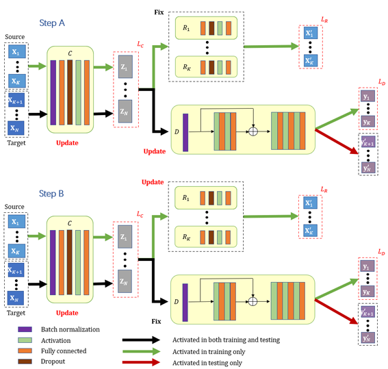

# NWCQ
## Deep learning based multi-batch calibration for classification in various omics

Codes and data for using our method, a novel deep learning framework for improving classification accuracy by multi-batch effect calibration in various omics data.

## Abstract
Computational analysis of high-throughput omics data has become popular over recent decades. However, classification accuracy is plagued with domain discrepancy caused by batch effect. To fully address issues that were not solved by conventional methods, we propose a joint deep learning framework for integrating batch effect removal and classification upon various omics data and demonstrate that our algorithm outperforms existing methods for improving classification accuracy in two private MALDI MS datasets and one public scRNA-seq dataset. The main contribution of this work lies that we conduct adversarial training by “walk-in two steps” strategy. Our framework is shown in figure below. 

## Dependencies
- Python 3.6.8 
- PyTorch 1.8.1+cu102  
- Sklearn 0.21.3 
- R 4.0.4 

## Files
The code we shared contains a total of three projects, which are contained in the MI, CHD and scRNA-seq folders, respectively. The potential .py source files contained in these folders are listed below, of which "crossValidation-complex.py" is only available in the MI project.
### codes
***multi-reBatch.py***: An example of training label known datasets and computing accuracy on label unknown datasets after batch effect removal 
***classify.py***: An example of training label known datasets and computing accuracy on label unknown datasets before calibration 
***crossValidation-complex.py***: 10 fold cross validation to request the upper bound of cross-batch prediction 
***network.py***: Class definitions for the architecture of each network (Calibrator, Reconstructors, Discriminator) 
***function.py***: Data preprocessing, definition of MMD and some functions that implement visualization 

### data
As for our private MALDI MS data, although our original collected sample data are not public, the preprocessed versions belong to the first two projects are shared in the corresponding data folder: 
   ***"1.csv", "2.csv", "3.csv"...***: Every batches of the data in the corresponding project. 
The public scRNA-seq dataset can be obtained directly from the published link in the original text, and we also provide the corresponding GEO number in the article.
   
**NOTE:** Each project is runing in the corresponding directory. The loss curve can be viewed in the corresponding plots folder. 

## Run our codes
1. Clone this git repository    
   `git clone https://github.com/n778509775/NWCQ.git`       
   and install all the requirements listed above. Our operating environment is Ubuntu 16.04. You should **install all packages** required by the program as follows：       
   `sudo pip3 install -r requirement.txt`    
   If only available for this user, please follow:    
   `pip3 install -r requirement.txt --user`    
     
   For individual packages like ‘tkinter’ that cannot be successfully installed by ‘pip’, please try:     
   `sudo apt-get install python3-tk`    
     
2. If you consider viewing classification results **before batch effect calibration**, you could run:        
   `python classify.py --data_folder your_data_path --dataset_file_list file_name_1 file_name_2 file_name_3...`      
   For example, assuming you are currently in the MI directory, please execute：    
   `python classify.py --dataset_file_list 2.csv 3.csv 1.csv`  
    
3. If you consider viewing classification results **after batch effect calibration**, you could run:          
   `python multi-reBatch.py --data_folder your_data_path --dataset_file_list file_name_1 file_name_2 file_name_3...`     
   For example, assuming you are currently in the CHD directory, please execute：    
   `python multi-reBatch.py --dataset_file_list 3.csv 4.csv 1.csv 2.csv`      
4. In order to obtain the upper bound of **cross-validation**, we could conduct 10 fold in-batch cross validation:        
    `python crossValidation-complex.py --data_folder your_data_path --train_file file_name`       
    For example, assuming you are currently in the MI directory, please execute：    
    `python crossValidation-complex.py --train_file 1.csv`  
     

## Citation
If you find this work useful for your research, please consider citing our article.
